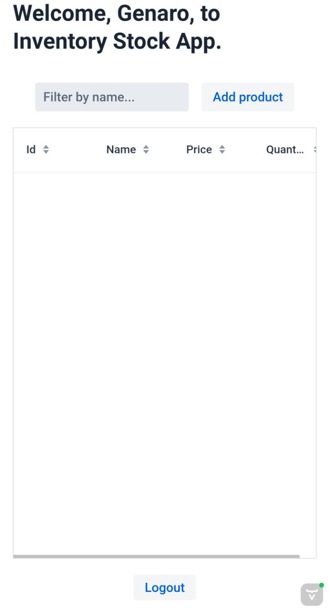

# StockApp
This is a CRUD application designed for the web, using Vaadin, Spring Security, Spring Data, Hibernate, and H2 Database.  
After creating a user account, you can log in and create products, which will be associated with the logged-in user. You can also delete or modify any of the products you create.  
The app includes Authorization and Authentication provided by Spring Security. Additionally, the app is built with Hibernate, which means it could work with any database you choose.  
Inside the collapsible below are some images showing the user flow. To showcase its responsiveness, the screenshots were taken using a mobile phone.

 
<h3>User flow</h3>

 
 Creating account and logging in:
 
 
 
 Add Crud grid view:
 
 

And the changes reflected on the database:

 

  
  
  
 

 

  
  
  

